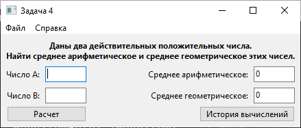

Анализ эффективности по GOMS
============================

Условные обозначения действий
-----------------------------

_TODO: время_

__R__ (response): ожидание ответа компьютера
__H__ (hand): смена устройства ввода (клавиатура __<->__ мышь)
__M__ (mental preparation): ментальная подготовка
__K__ (keypress): нажатие клавиши клавиатуры (кнопки мыши)
__P__ (point/pointer): перемещение указателя (мыши или пальца над сенсорным экраном)

Пусть _n_ - длина числа - равна 5.

При помощи мыши:
----------------

Рука на мыши; первое поле ввода уже активно.

1. __R__: [ожидание запуска]
2. __H__: мышь -> клавиатура
3. __M nK__: ввод первого числа
4. __H MPK H__: временное переключение на мышь; переход на следующее поле
5. __M nK__: ввод второго числа
6. __H MPK__: клавиатура -> мышь; кнопка __ОК__
7. __R__: [ожидание ответа]

Время взаимодействия (без учета ожидания): __11,6 сек.__

При максимальном использовании клавиатуры:
------------------------------------------

Рука на клавиатуре; первое поле ввода активно.

1. __R__: [ожидание запуска]
3. __M nK__: ввод первого числа
4. __M K__: Tab
5. __M nK__: ввод второго числа
4. __M K__: Enter
7. __R__: [ожидание ответа]

Время взаимодействия (без учета ожидания): __7,8 сек.__

Сокращение времени на выполнение задачи при _максимальном использовании клавиатуры_: __3,8 сек.__ (на __33%__)
