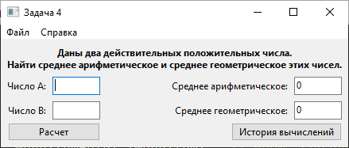

Анализ эффективности по GOMS
============================

GOMS - модель исследования эффективности взаимодействия пользователя с программой.
Включает:
- **G**oals - цели пользователя
- **O**perators - примитивные операции, см. ниже
- **M**ethods - методы, которыми пользователь может достичь цели
- **S**election rules - правила выбора метода.

Используется вариант __KLM__-GOMS: **K**eystroke-**L**evel **M**odel, модель уровня нажатий клавиш.

---

Исследуемая программа:

Операторы
-----------------------------

- __K__ (~0.2 сек.) (keypress/keystroke): нажатие клавиши клавиатуры (кнопки мыши)
- __P__ (~1.1 сек.) (point/-er/-ing): перемещение указателя мыши, или пальца над сенсорным экраном
- __H__ (~0.4 сек.) (home position/hand): смена устройства ввода (клавиатура <-> мышь)
- __M__ (~1.35 сек.) (mental preparation): ментальная подготовка, напр. размышление перед действием, поиск элемента на экране
- __R__ (response): ожидание ответа компьютера. Варьируется больше остальных. Отсутствует среднее значение.

Пусть _n_ - длина числа - равна 5.

Метод 1. При помощи мыши:
----------------

Рука на мыши; первое поле ввода уже активно.

- __R__: [ожидание запуска]
- __H + M+n*K + H__: временное переключение на __клавиатуру__; ввод первого числа
- __M+P+K__: переход на следующее поле
- __H + M+n*K + H__: временное переключение на __клавиатуру__; ввод второго числа
- __M+P+K__: кнопка __ОК__
- __R__: [ожидание ответа]

Суммируем операторы.
Время взаимодействия (без учета ожидания): __11,6 сек.__

Метод 2. При максимальном использовании клавиатуры:
------------------------------------------

Рука на клавиатуре; первое поле ввода активно.

- __R__: [ожидание запуска]
- __M + n*K__: ввод первого числа
- __M + K__: Tab
- __M + n*K__: ввод второго числа
- __M + K__: Enter
- __R__: [ожидание ответа]

Суммируем операторы.
Время взаимодействия (без учета ожидания): __7,8 сек.__

Итог
----

Сокращение времени на выполнение задачи при _максимальном использовании клавиатуры_: __3,8 сек.__ (на __33%__)
