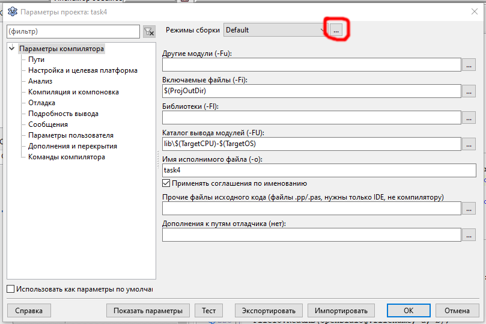

Уменьшение размера исполняемого файла
===

Размер исполняемого файла (`task4.exe`) без оптимизации: __24 615__ КБ

Для оптимизации можно воспользоваться встроенным средством для создания _конечного_ профиля сборки (__Release__) и профиля _для отладки_ (__Debug__)

Размер исполняемого файла после выбора профиля __Release__: __2 658__ КБ, что почти в 10 раз меньше исходного.