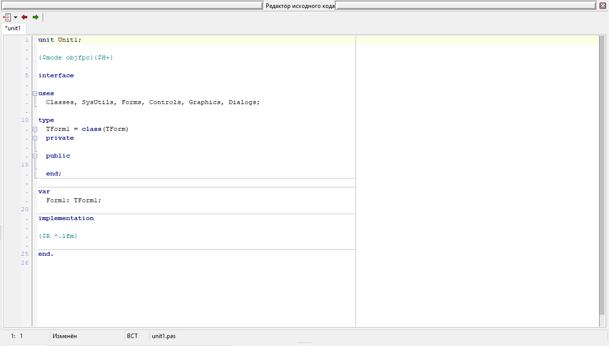
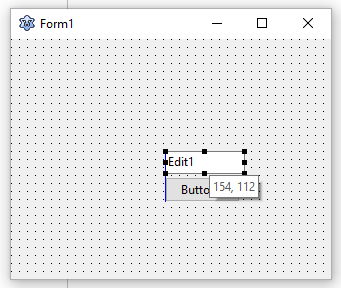
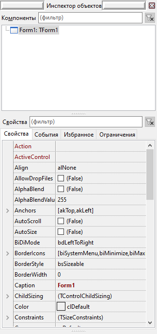
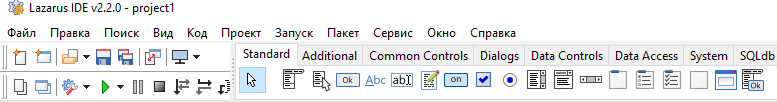
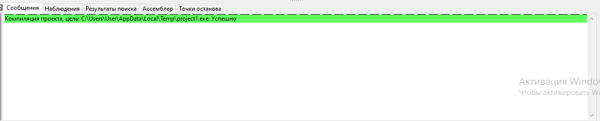

Lazarus. Создание программ с графическим интерфейсом
====================================================

**Lazarus** - интегрированная среда разработки (**IDE**) с открытым исходным кодом для быстрой разработки приложений (**RAD**), обеспечивающая совместимость с **Borland Delphi**.

Управление проектами
--------------------

Управление проектами осуществляется при помощи меню **"Проект"**. Меню **"Файл"** предназначено для работы с отдельными файлами проекта, однако в некоторых случаях также может быть использовано.

**Создать:** *Проект -> Создать проект*

**Сохранить:** *Проект -> Сохранить проект* (также при первом запуске: *Файл -> Сохранить как...*)

**Открыть:** *Проект -> Открыть проект* (также: *Файл -> Открыть...* или открыть файл с расширением `.lpi`)

Основные окна/панели
--------------------

- **Редактор исходного кода**

  
- **Редактор форм** (окон приложения)

  
- **Инспектор объектов:** дерево компонентов; настройка их свойств

  
- **Главная панель**

  
    - **Строка меню:** _Файл, Правка, Вид, Проект..._
    - **Инструментальные панели:** Кнопки команд *Запуск, Сохранить, Создать...*
    - **Палитра компонентов** (элементов окна)
- **Панель сообщений компилятора**

  

Файлы проекта
-------------

- **Главный файл проекта:** `<имя_проекта>.lpi` (**L**azarus **P**roject **I**nformation)

  Содержит большинство параметров проекта, а также расположение остальных файлов проекта

- **Файл сохранения сессии:** `<имя_проекта>.lps` (**L**azarus **P**roject **S**ession):

  Содержит информацию о состоянии Lazarus при работе с проектом (расположение окон, открытые файлы...)

- **Исходный код исполняемого файла:** `<имя_проекта>.lpr` (**L**azarus **Pr**ogram):

  Исходный код для точки входа в программу. Начинается с `program <имя_проекта>;`. Импортирует (`uses`) модули проекта и стандартные модули Lazarus.

- **Файл формы:** `<имя_формы>.lfm` (**L**azarus **F**or**m**):

  Содержит свойства формы (окна), изменяемые при помощи **Инспектора Объектов**. _View_ по модели MVC

- **Файл ресурсов** (`*.res`):

  Содержит используемые в программе ресурсы в скомпилированном виде, в частности свойства формы, полученные из `.lfm`.

- **Модуль формы** (`<имя_формы>.pas`):
  
  Содержит класс формы и обработчики событий. Импортируется (`uses`) в главном файле программы (`.lpr`). _Controller_ по модели MVC

- **Другие модули** (`*.pas`):

  Содержат процедуры, функции, константы, используемые другими частями программы (обработчиками событий, главной программой). _Model_ по MVC

- **Исполняемый файл:** `<имя_проекта>.exe` (в MS Windows):

  Готовая программа. Создается компилятором из исходного кода программы, модулей, файлов ресурсов

Список модулей и форм
---------------------
**Список модулей** можно открыть при помощи кнопки **Модули...** на инструментальной панели (вверху экрана) или нажав **Ctrl+F12**.

Аналогично, **Список форм** можно открыть при помощи кнопки **Формы...**, находящейся рядом с кнопкой списка модулей; или комбинацией клавиш **Shift+F12**

Обработчики событий
-------------------

В __Редакторе форм__ для компонента можно создать обработчик события по умолчанию, выбрав соответствующий пункт в контекстном меню (правой кнопкой мыши по компоненту). Также его можно создать двойным щелчком по нему.

После этого в __Редакторе исходного кода__ откроется созданная процедура обработчика, изначально пустая. В ней можно написать код обработчика.

Это работает как для кнопок (`TButton`), так и для большинства других видимых компонентов Lazarus.

Элементы интерфейса (_компоненты_)
--------------------------------

**Кнопка:** `TButton`

**Поле ввода** (однострочное): `TEdit`

**Надпись:** `TLabel`

За __текстовое содержимое__ компонента отвечает свойство `Text`.

За __подпись__ отвечает свойство `Caption`.

За __имя компонента в коде__ отвечает свойство `Name`. Оно должно соответствовать требованиям к _идентификаторам_ (именам переменных) в Pascal. Его нельзя просто изменить в коде, ведь на него ссылаются другие файлы проекта. При изменении свойства `Name` среда Lazarus самостоятельно обновляет эти ссылки.

Свойства компонента можно изменить в **Инспекторе объектов**, выбрав его в дереве компонентов или редакторе форм.

Ссылки
------

__Ссылка на задание:__ [Задание 3. Конспект](https://github.com/ivtipm/HCI/blob/master/plans/2025/plan.md#%D0%B7%D0%B0%D0%B4%D0%B0%D0%BD%D0%B8%D0%B5-3-%D0%BA%D0%BE%D0%BD%D1%81%D0%BF%D0%B5%D0%BA%D1%82)

__Free Pascal Wiki__ - официальный вики-ресурс Free Pascal: <https://wiki.freepascal.org/>

__Free Pascal Wiki: файлы проекта Lazarus:__ <https://wiki.freepascal.org/Lazarus_project_files>

__Неофициальный русскоязычный портал Free Pascal:__ <http://freepascal.ru>

__Инструкция по объединению окон Lazarus:__ <https://devlaz.ru/lazarus-%D0%B2-%D0%BE%D0%B4%D0%BD%D0%BE%D0%BC-%D0%BE%D0%BA%D0%BD%D0%B5/>

---

__Автор:__ Николай Ковалев