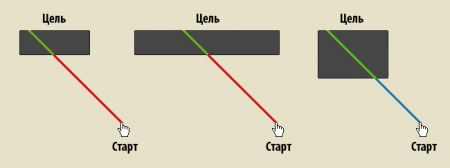
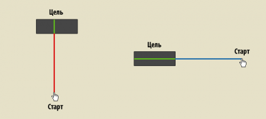
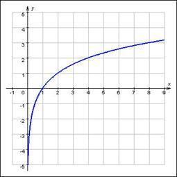
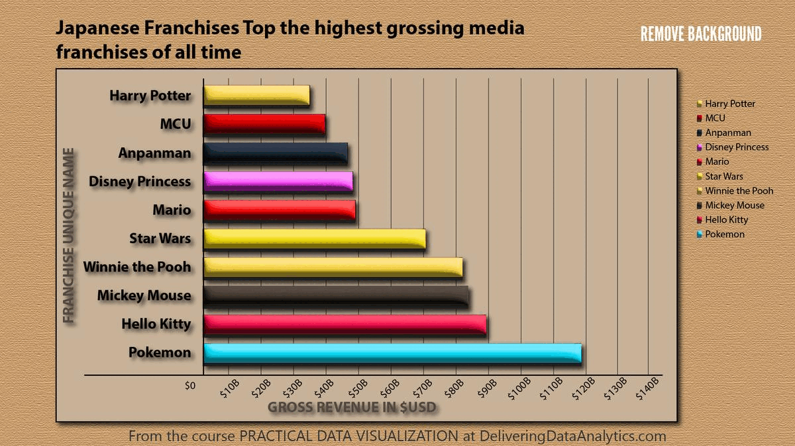
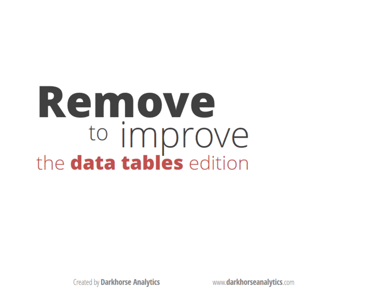

> Все модели неверны, но некоторые полезны

Закон Фиттса
============

Формальное задание
------------------

> T = a + b * log2( D/W + 1 )

`T` - время наведения указателя на цель

`a`, `b` - константы:

- `a` - среднее время на начало и остановку движения

- `b` - величина, зависящая от средней скорости движения указателя

`D` - расстояние от указателя до центра цели

`W` - Размер цели при измерении __вдоль__ движения указателя

Закон бесконечной ширины на границе
-----------------------------------

> Если цель находится на границе экрана, то её размер считается бесконечным
>
> (т.к. по курсор не двигается за границу экрана)

Допущения
---------

Предполагается, что пользователь:
- Не промахивается
- Не ищет указатель и цель
- Скорость не зависит от направления

Смысл
-----

Часто используемые элементы:
- Делайте крупнее
- Располагайте на границе окна
- Сокращайте расстояния до них при типичном движении курсора

__BTW:__ Эффект выскакивания!

Закон Хика
==========

Для равновероятных альтернатив:

> T = a + b * log2( n + 1 )

`T` - время выбора альтернативы (напр. элемента меню, вкладки)

`a`, `b` - константы

`n` - кол-во альтернатив

1 - вариант отказа от выбора

Допущения
---------

- Пользователь знаком с элементами выбора
- Не обдумывает каждый вариант
- Не учитывается поиск цели (как и в законе Фиттса)

Смысл
-----

Сокращайте выбор!

Логарифмическая зависимость
---------------------------

Информационная эффективность
============================

> E = I_мин / I_введ

Где:
 - `I_мин` - кол-во информации, необходимое для выполнения задачи
 - `I_введ` - фактически введённое кол-во информации

__Исключение:__ не нужно вводить информацию и она не была введена. В таком случае:

> E = 1 = 100%

__Частный случай:__ всплывающие сообщения.
- `I_мин` = 0 бит;
- `I_введ` = 1 бит.
- `E` = 0

Чем выше, тем лучше!

Смысл
-----

Измерение кол-ва информации
---------------------------

> I = log2(n)

n - кол-во вариантов выбора

Data-ink ratio
==============

<!--  -->
<!--  -->
<!--  -->
<!--  -->

<!--  -->

Букв. "доля чернил с данными".

__Суть:__ Информативная доля чернил

> R = N_data / N_total

- `N_data` - кол-во чернил, необходимых для отображения данных
- `N_total` - кол-во фактически затраченых чернил

Низкий показатель свидетельствует о наличии информационного шума.

В качестве кол-ва чернил можно использовать закрашенную площадь или кол-во занимемых пикселей

Смысл
-----

- Не забывайте о воздухе!
- Делайте интерфейс минималистичным

Usecase
=======

Отражает возможности пользователей с более технической точки зрения: напр. разграничение прав (админ, гость, зарег. по-ль)

Роль `!=` персонаж

Некоего рода ТЗ, поэтому желательно включить все!

Figma
=====

- Фреймы - экраны или окна
- Стили, сетки
- Компоненты
- Прототипирование?